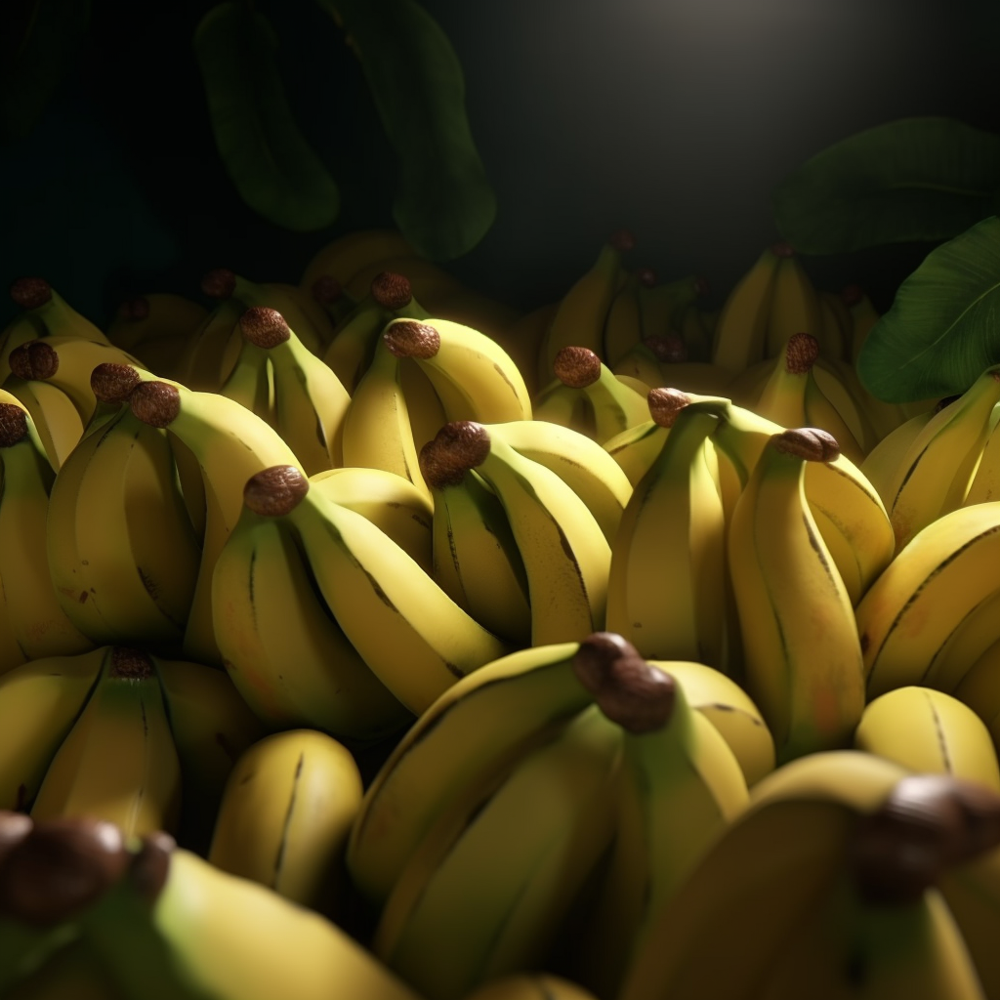

<h1 align="center">
Problem 12: Bunch of Bananas
</h1>

<h4 align="center">
There were 24 bananas in a bunch, but 13 of them were eaten. How many bananas are left in the bunch?
</h4>

<h3 align="center"><a href="https://raw.githubusercontent.com/rain1024/math/main/assets/lose0.png">A. 14</a>&nbsp;&nbsp;&nbsp;&nbsp;
<a href="https://raw.githubusercontent.com/rain1024/math/main/assets/win0.png">B. 11</a>&nbsp;&nbsp;&nbsp;&nbsp;
<a href="https://raw.githubusercontent.com/rain1024/math/main/assets/lose0.png">C. 20</a>&nbsp;&nbsp;&nbsp;&nbsp;
<a href="https://raw.githubusercontent.com/rain1024/math/main/assets/lose0.png">D. 9</a>&nbsp;&nbsp;&nbsp;&nbsp;
</h3>