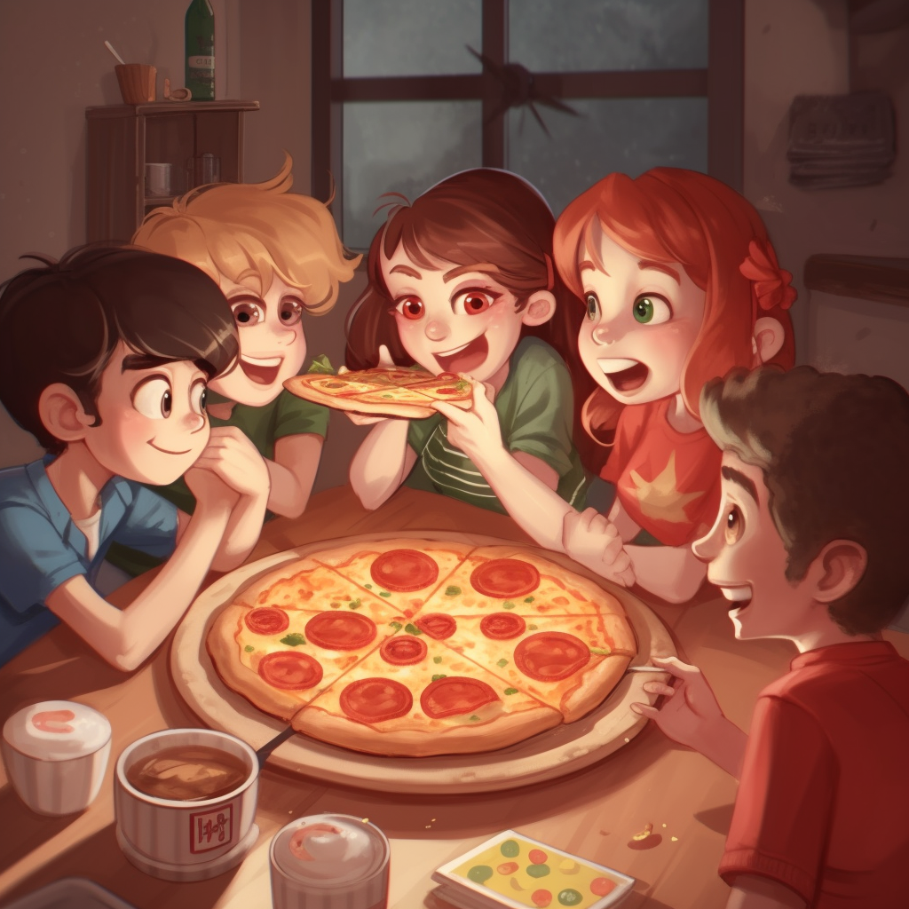

<h1 align="center">
Problem 13: Pizza Party
</h1>

<h4 align="center">
Zoe ordered 3 pizzas with 4 slices each. How many slices of pizza does she have in total?
</h4>

<h3 align="center"><a href="https://raw.githubusercontent.com/rain1024/math/main/assets/win0.png">A. 12</a>&nbsp;&nbsp;&nbsp;&nbsp;
<a href="https://raw.githubusercontent.com/rain1024/math/main/assets/lose0.png">B. 13</a>&nbsp;&nbsp;&nbsp;&nbsp;
<a href="https://raw.githubusercontent.com/rain1024/math/main/assets/lose0.png">C. 9</a>&nbsp;&nbsp;&nbsp;&nbsp;
<a href="https://raw.githubusercontent.com/rain1024/math/main/assets/lose0.png">D. 7</a>&nbsp;&nbsp;&nbsp;&nbsp;
</h3>