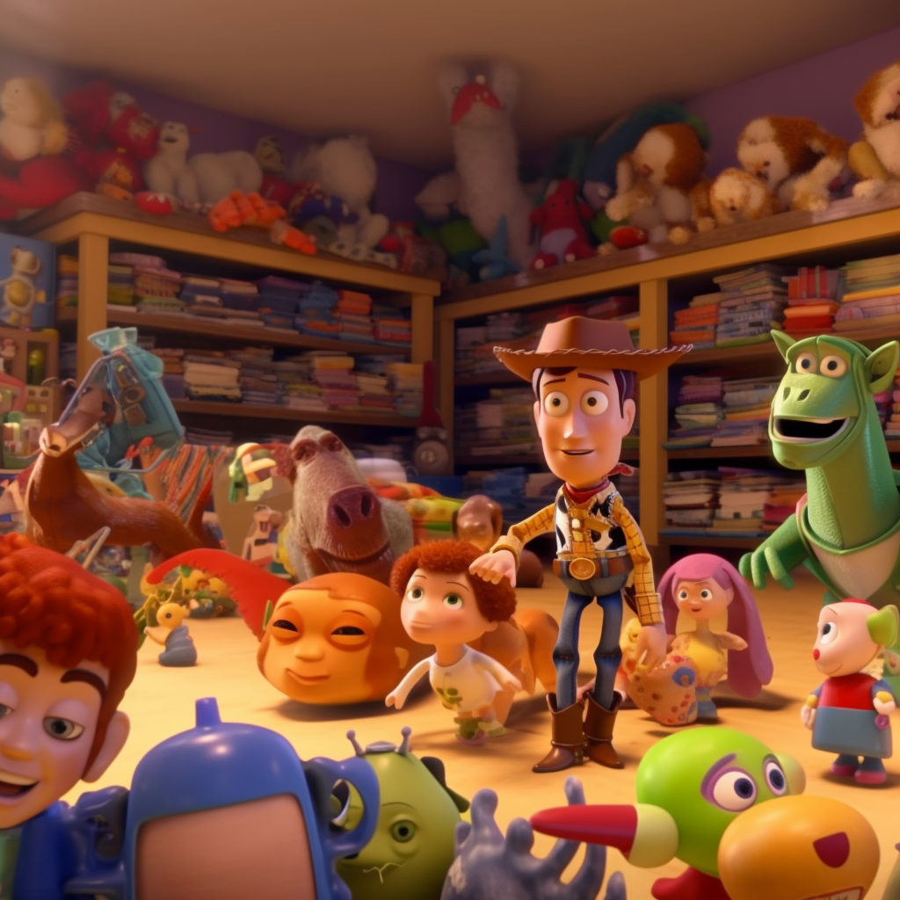

<h1 align="center">
Problem 14: Toy Shop
</h1>

<h4 align="center">
If each toy costs $2 and you want to buy 5 toys How much money will you need in total?
</h4>

<h3 align="center"><a href="https://raw.githubusercontent.com/rain1024/math/main/assets/win0.png">A. 10</a>&nbsp;&nbsp;&nbsp;&nbsp;
<a href="https://raw.githubusercontent.com/rain1024/math/main/assets/lose0.png">B. 6</a>&nbsp;&nbsp;&nbsp;&nbsp;
<a href="https://raw.githubusercontent.com/rain1024/math/main/assets/lose0.png">C. 8</a>&nbsp;&nbsp;&nbsp;&nbsp;
<a href="https://raw.githubusercontent.com/rain1024/math/main/assets/lose0.png">D. 15</a>&nbsp;&nbsp;&nbsp;&nbsp;
</h3>