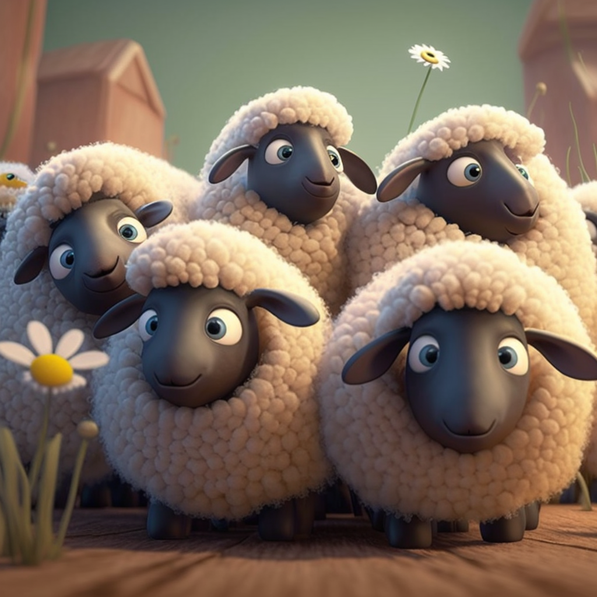

# Problem 2

<h4 align="center">
How many sheeps are there?
</h4>

<h4 align="center">
  <a href="">A. 3</a>&nbsp;&nbsp;&nbsp;&nbsp;
  <a href="">B. 10</a>&nbsp;&nbsp;&nbsp;&nbsp;
  <a href="/assets/win0.png">C. 5</a>&nbsp;&nbsp;&nbsp;&nbsp;
  <a href="">D. 20</a>&nbsp;&nbsp;&nbsp;&nbsp;
</h4>