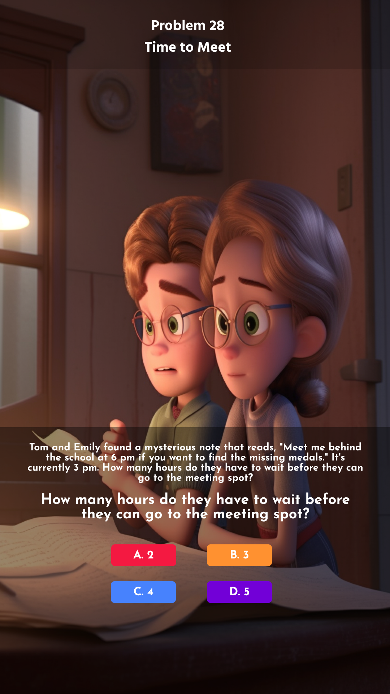

<h1 align="center">
Problem 28: Time to Meet
</h1>

<h4 align="center">
Tom and Emily found a mysterious note that reads, "Meet me behind the school at 6 pm if you want to find the missing medals." It's currently 3 pm. How many hours do they have to wait before they can go to the meeting spot?
</h4>

<h3 align="center"><a href="https://raw.githubusercontent.com/rain1024/math/main/assets/lose0.png">A. 5</a>&nbsp;&nbsp;&nbsp;&nbsp;
<a href="https://raw.githubusercontent.com/rain1024/math/main/assets/lose0.png">B. 2</a>&nbsp;&nbsp;&nbsp;&nbsp;
<a href="https://raw.githubusercontent.com/rain1024/math/main/assets/lose0.png">C. 4</a>&nbsp;&nbsp;&nbsp;&nbsp;
<a href="https://raw.githubusercontent.com/rain1024/math/main/assets/win0.png">D. 3</a>&nbsp;&nbsp;&nbsp;&nbsp;
</h3>