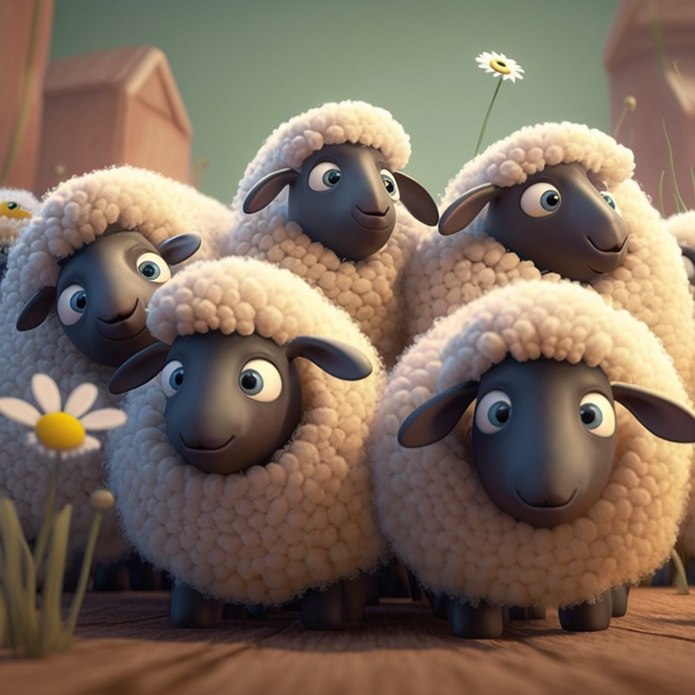

<h1 align="center">
Problem 3: How many chickens are there?
</h1>

<h3 align="center">
  <a href="https://raw.githubusercontent.com/rain1024/math/main/assets/lose0.png">A. 5</a>&nbsp;&nbsp;&nbsp;&nbsp;
  <a href="https://raw.githubusercontent.com/rain1024/math/main/assets/lose0.png">B. 7</a>&nbsp;&nbsp;&nbsp;&nbsp;
  <a href="https://raw.githubusercontent.com/rain1024/math/main/assets/lose0.png">C. 10</a>&nbsp;&nbsp;&nbsp;&nbsp;
  <a href="https://raw.githubusercontent.com/rain1024/math/main/assets/win0.png">D. 3</a>&nbsp;&nbsp;&nbsp;&nbsp;
</h3>