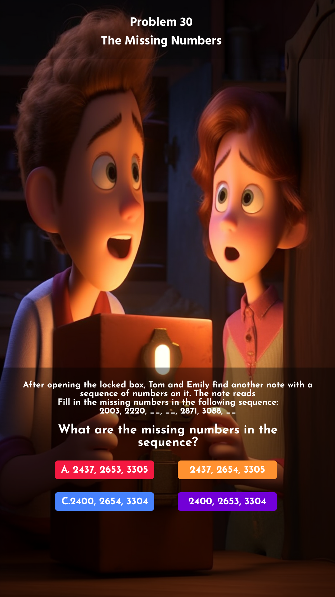

<h1 align="center">
Problem 30: The Missing Numbers
</h1>

<h4 align="center">
After opening the locked box, Tom and Emily find another note with a sequence of numbers on it. The note reads, Fill in the missing numbers in the following sequence: 2003, 2220, __, __, 2871, 3088, __. What are the missing numbers in the sequence? 
</h4>

<h3 align="center"><a href="https://raw.githubusercontent.com/rain1024/math/main/assets/lose0.png">A. 2437, 2653, 3305</a>&nbsp;&nbsp;&nbsp;&nbsp;
<a href="https://raw.githubusercontent.com/rain1024/math/main/assets/lose0.png">B. 2400, 2654, 3304</a>&nbsp;&nbsp;&nbsp;&nbsp;
<a href="https://raw.githubusercontent.com/rain1024/math/main/assets/win0.png">C. 2437, 2654, 3305</a>&nbsp;&nbsp;&nbsp;&nbsp;
<a href="https://raw.githubusercontent.com/rain1024/math/main/assets/lose0.png">D. 2400, 2653, 3304</a>&nbsp;&nbsp;&nbsp;&nbsp;
</h3>