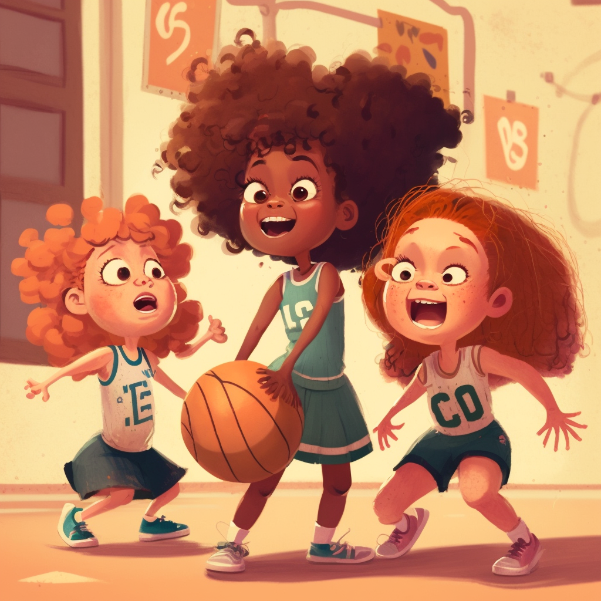

<h1 align="center">
Problem 4: Basketball
</h1>

<h4 align="center">
As Sarah was playing basketball with her friends, she realized that the ball they were using had a unique shape. Can you help her identify the shape of a basketball?
</h4>

<h3 align="center"><a href="https://raw.githubusercontent.com/rain1024/math/main/assets/win0.png">A. Circle</a>&nbsp;&nbsp;&nbsp;&nbsp;
<a href="https://raw.githubusercontent.com/rain1024/math/main/assets/lose0.png">B. Square</a>&nbsp;&nbsp;&nbsp;&nbsp;
<a href="https://raw.githubusercontent.com/rain1024/math/main/assets/lose0.png">C. Triangle</a>&nbsp;&nbsp;&nbsp;&nbsp;
<a href="https://raw.githubusercontent.com/rain1024/math/main/assets/lose0.png">D. Rectangle</a>&nbsp;&nbsp;&nbsp;&nbsp;
</h3>