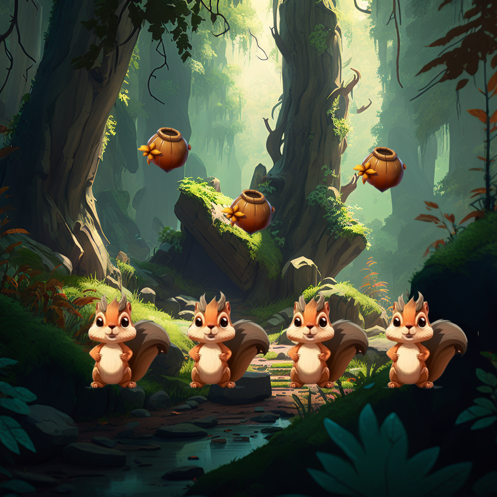

<h1 align="center">
Problem 5: Hungry squirrels
</h1>

<h4 align="center">
In the forest, Nutmeg, Pecan, Chestnut, and Walnut, four hungry squirrels, found three acorns, and they all wanted to have a taste of the delicious treat
</h4>

<h3 align="center"><a href="https://raw.githubusercontent.com/rain1024/math/main/assets/win0.png">A. False</a>&nbsp;&nbsp;&nbsp;&nbsp;
<a href="https://raw.githubusercontent.com/rain1024/math/main/assets/lose0.png">B. True</a>&nbsp;&nbsp;&nbsp;&nbsp;
</h3>