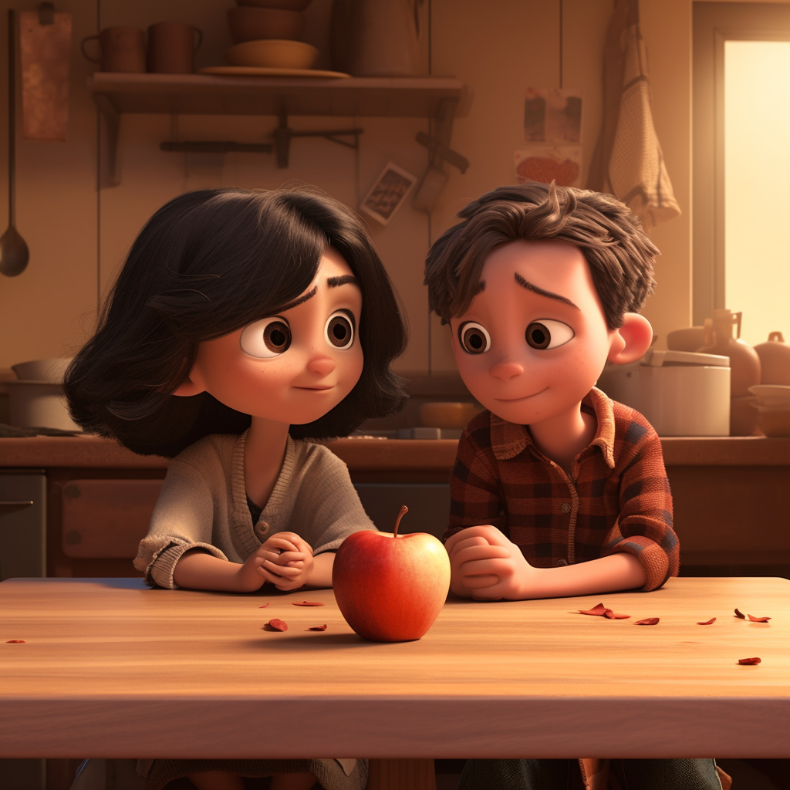

<h1 align="center">
Problem 6: Sharing is Caring
</h1>

<h4 align="center">
Samantha and Jack are classmates who love to share their snacks during recess. Samantha has 3 apples and her friend Jack gives her 2 more. How many apples does Samantha have in total?
</h4>

<h3 align="center"><a href="https://raw.githubusercontent.com/rain1024/math/main/assets/lose0.png">A. 2</a>&nbsp;&nbsp;&nbsp;&nbsp;
<a href="https://raw.githubusercontent.com/rain1024/math/main/assets/lose0.png">B. 7</a>&nbsp;&nbsp;&nbsp;&nbsp;
<a href="https://raw.githubusercontent.com/rain1024/math/main/assets/lose0.png">C. 3</a>&nbsp;&nbsp;&nbsp;&nbsp;
<a href="https://raw.githubusercontent.com/rain1024/math/main/assets/win0.png">D. 5</a>&nbsp;&nbsp;&nbsp;&nbsp;
</h3>