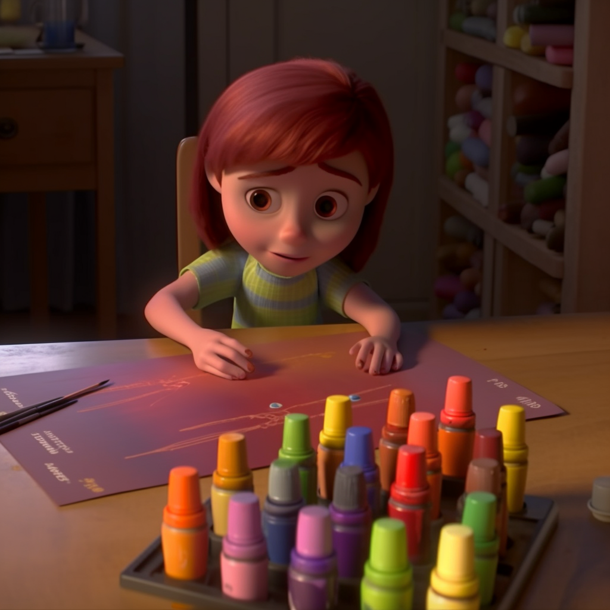

<h1 align="center">
Problem 9: Oopsie Daisy
</h1>

<h4 align="center">
Sarah has 8 crayons, but she accidentally breaks 3 of them. How many crayons does Sarah have left?
</h4>

<h3 align="center"><a href="https://raw.githubusercontent.com/rain1024/math/main/assets/lose0.png">A. 10</a>&nbsp;&nbsp;&nbsp;&nbsp;
<a href="https://raw.githubusercontent.com/rain1024/math/main/assets/lose0.png">B. 3</a>&nbsp;&nbsp;&nbsp;&nbsp;
<a href="https://raw.githubusercontent.com/rain1024/math/main/assets/win0.png">C. 5</a>&nbsp;&nbsp;&nbsp;&nbsp;
<a href="https://raw.githubusercontent.com/rain1024/math/main/assets/lose0.png">D. 8</a>&nbsp;&nbsp;&nbsp;&nbsp;
</h3>